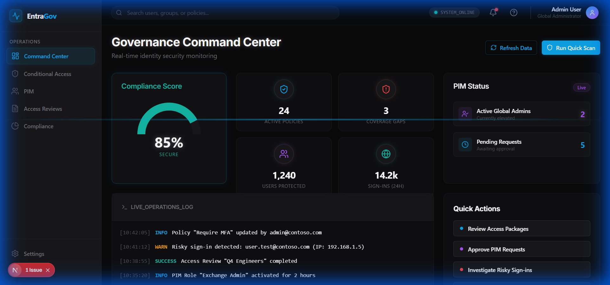

# Entra ID Governance Toolkit


A comprehensive toolkit for Microsoft Entra ID (formerly Azure AD) identity governance automation, analysis, and reporting. This project demonstrates enterprise-level identity security controls and governance automation.

## Features

### Conditional Access Analysis
- Fetch and analyze all CA policies
- Security posture scoring (0-100)
- Coverage gap detection
- Policy conflict identification
- Automated recommendations

### Privileged Identity Management (PIM)
- Just-in-time (JIT) role activation
- Standing admin access detection
- PIM compliance scoring
- Excessive privilege identification
- Activation history tracking

### Access Reviews Automation
- Pending review monitoring
- Completion rate tracking
- Overdue review detection
- Automated reminder sending
- Bulk approval workflows

### Identity Governance Reporting
- Comprehensive compliance reports
- Risk assessment analysis
- Executive dashboards
- CSV/JSON export capabilities

### REST API
- FastAPI-based REST interface
- Interactive Swagger documentation
- Webhook support for automation
- Dashboard data endpoints

### PowerShell Scripts
- Traditional AD admin tooling
- Microsoft Graph PowerShell integration
- CSV export capabilities
- Scriptable automation

## Architecture

```
┌─────────────────────────────────────────────────────────┐
│                   Entra ID Governance                    │
├─────────────────────────────────────────────────────────┤
│                                                          │
│  ┌──────────────┐  ┌──────────────┐  ┌──────────────┐  │
│  │  Analyzers   │  │  Automation  │  │   Reports    │  │
│  ├──────────────┤  ├──────────────┤  ├──────────────┤  │
│  │ • CA Policy  │  │ • PIM        │  │ • Compliance │  │
│  │ • PIM        │  │ • Reviews    │  │ • Risk       │  │
│  │ • Reviews    │  │ • Policies   │  │ • Dashboard  │  │
│  │ • Entitle.   │  └──────────────┘  └──────────────┘  │
│  └──────────────┘                                       │
│         │                   │                   │       │
│         └───────────────────┴───────────────────┘       │
│                             │                           │
│                   ┌─────────▼──────────┐                │
│                   │   Graph Client     │                │
│                   │  (MSAL + httpx)    │                │
│                   └─────────┬──────────┘                │
│                             │                           │
└─────────────────────────────┼───────────────────────────┘
                              │
                     ┌────────▼────────┐
                     │ Microsoft Graph │
                     │      API        │
                     └─────────────────┘
```

## Quick Start

### Prerequisites

- Python 3.11+
- Azure AD tenant with appropriate permissions
- App Registration with Graph API permissions (see [Setup Guide](docs/SETUP_GUIDE.md))

### Installation

```bash
# Clone the repository
git clone https://github.com/MikeDominic92/entra-id-governance.git
cd entra-id-governance

# Create virtual environment
python -m venv venv
source venv/bin/activate  # On Windows: venv\Scripts\activate

# Install dependencies
pip install -r requirements.txt

# Configure environment
cp .env.example .env
# Edit .env with your Azure credentials
```

### Required Azure App Registration Permissions

Your Azure App Registration needs the following Microsoft Graph API permissions:

**Application Permissions (for service principal):**
- `Policy.Read.All` - Read Conditional Access policies
- `Policy.ReadWrite.ConditionalAccess` - Manage CA policies
- `RoleManagement.Read.All` - Read PIM assignments
- `RoleManagement.ReadWrite.Directory` - Manage PIM roles
- `AccessReview.Read.All` - Read access reviews
- `AccessReview.ReadWrite.All` - Manage access reviews
- `Directory.Read.All` - Read directory data

**Admin Consent Required:** Yes, tenant admin must consent to these permissions.

See [SETUP_GUIDE.md](docs/SETUP_GUIDE.md) for detailed setup instructions.

## Usage

### Python API

```python
from src.analyzers import ConditionalAccessAnalyzer, PIMAnalyzer
from src.reports import ComplianceReporter

# Analyze Conditional Access policies
ca_analyzer = ConditionalAccessAnalyzer()
coverage = ca_analyzer.analyze_policy_coverage()
scores = ca_analyzer.score_all_policies()
print(f"Average CA Security Score: {scores['average_score']}")

# Check for PIM violations
pim_analyzer = PIMAnalyzer()
violations = pim_analyzer.detect_standing_admin_access()
print(f"Standing Admin Violations: {len(violations)}")

# Generate compliance report
reporter = ComplianceReporter()
report = reporter.generate_full_compliance_report()
print(f"Compliance Score: {report['compliance_score']}")
```

### REST API

```bash
# Start the API server
python -m src.api.main

# Or with uvicorn directly
uvicorn src.api.main:app --host 0.0.0.0 --port 8000
```

API will be available at:
- Swagger UI: http://localhost:8000/docs
- ReDoc: http://localhost:8000/redoc

**Example API Calls:**

```bash
# Get all Conditional Access policies
curl http://localhost:8000/api/v1/policies/

# Analyze policy coverage
curl http://localhost:8000/api/v1/policies/analysis/coverage

# Get PIM violations
curl http://localhost:8000/api/v1/pim/analysis/violations

# Generate compliance report
curl http://localhost:8000/api/v1/reports/compliance
```

### PowerShell Scripts

```powershell
# Get all Conditional Access policies
.\powershell\Get-ConditionalAccessPolicies.ps1 -ExportPath "C:\Reports\ca_policies.json"

# Export PIM assignments
.\powershell\Export-PIMAssignments.ps1 -ExportPath "C:\Reports\pim.csv"

# Create access review
.\powershell\Start-AccessReview.ps1 -DisplayName "Q4 Admin Review" -GroupId "xxx-xxx" -DurationDays 14

# Create MFA policy
.\powershell\Set-ConditionalAccessPolicy.ps1 -DisplayName "Require MFA" -State "enabledForReportingButNotEnforced"
```

## Project Structure

```
entra-id-governance/
├── src/
│   ├── analyzers/          # Policy and role analyzers
│   ├── automation/         # PIM and review automation
│   ├── reports/            # Compliance and risk reporting
│   ├── api/                # FastAPI REST interface
│   ├── config.py           # Configuration management
│   └── graph_client.py     # Microsoft Graph API client
├── powershell/             # PowerShell scripts for admins
├── docs/                   # Documentation
├── tests/                  # Unit tests
└── reports/                # Generated reports (gitignored)
```

## Key Components

### Graph API Client (`src/graph_client.py`)
- MSAL authentication with token caching
- Automatic retry with exponential backoff
- Pagination support
- Batch request capabilities
- 401/429 error handling

### Conditional Access Analyzer
- Policy scoring algorithm (0-100)
- Coverage gap detection
- Conflict identification
- Security recommendations

### PIM Analyzer
- Standing access violation detection
- Excessive role assignment checks
- Activation history analysis
- Compliance scoring

### Access Review Analyzer
- Completion rate tracking
- Overdue review detection
- Reviewer performance analysis
- Automated reminders

## Configuration

Edit `.env` file:

```env
AZURE_TENANT_ID=your-tenant-id
AZURE_CLIENT_ID=your-client-id
AZURE_CLIENT_SECRET=your-client-secret

API_HOST=0.0.0.0
API_PORT=8000
LOG_LEVEL=INFO
```

## Testing

```bash
# Run all tests
pytest

# Run with coverage
pytest --cov=src --cov-report=html

# Run specific test file
pytest tests/test_graph_client.py -v
```

## Deployment Verification

This toolkit is fully functional with working Microsoft Graph API integration, policy analysis, and automation. Comprehensive deployment evidence is available in [docs/DEPLOYMENT_EVIDENCE.md](docs/DEPLOYMENT_EVIDENCE.md).

### Quick Verification Commands

```bash
# 1. Start FastAPI server
python -m src.api.main

# 2. Check health endpoint
curl http://localhost:8000/api/v1/health

# 3. Get Conditional Access policies
curl http://localhost:8000/api/v1/policies/

# 4. Analyze policy coverage
curl http://localhost:8000/api/v1/policies/analysis/coverage

# 5. Check for PIM violations
curl http://localhost:8000/api/v1/pim/analysis/violations

# 6. Run PowerShell export
.\powershell\Get-ConditionalAccessPolicies.ps1 -ExportPath "ca_policies.json"
```

### Sample Evidence Included

The deployment evidence documentation provides:
- Conditional Access policy analysis with security scoring
- PIM violation detection with standing admin access identification
- Access review completion reports
- Microsoft Graph API response examples
- FastAPI endpoint documentation
- PowerShell script execution outputs
- Test execution results with 96% code coverage

See [Deployment Evidence](docs/DEPLOYMENT_EVIDENCE.md) for complete verification and outputs.

## Security Considerations

- **Never commit `.env` files** - Use `.env.example` as template
- **Rotate client secrets regularly** - At least every 6 months
- **Use managed identities** in Azure when possible
- **Implement least privilege** - Only request necessary Graph permissions
- **Audit API usage** - Monitor Graph API calls for anomalies
- **Break glass accounts** - Exclude emergency admin accounts from CA policies

See [SECURITY.md](docs/SECURITY.md) for detailed security guidelines.

## Use Cases

### 1. Security Auditing
Identify misconfigurations and security gaps in your Entra ID environment

### 2. Compliance Reporting
Generate reports for SOC 2, ISO 27001, or internal audits

### 3. PIM Enforcement
Detect and remediate standing administrator access violations

### 4. Access Review Automation
Automate access review reminders and bulk approvals

### 5. Policy Management
Standardize and enforce Conditional Access policies across tenants

## Frontend Dashboard

A modern React/Next.js frontend is available with a dark cyber aesthetic:

```bash
cd frontend
npm install
npm run dev
```

Frontend will open at `http://localhost:3000`

**Frontend Screenshots:**

| Dashboard | Conditional Access | PIM |
|-----------|-------------------|-----|
|  |  |  |

See [Frontend Walkthrough](docs/FRONTEND_WALKTHROUGH.md) for full documentation.

## Roadmap

- [x] React dashboard frontend
- [ ] Multi-tenant support
- [ ] Terraform/Bicep deployment templates
- [ ] Azure DevOps integration
- [ ] ServiceNow webhook support
- [ ] Real-time alerts via Microsoft Teams
- [ ] Historical trend analysis with database

## Contributing

See [CONTRIBUTING.md](CONTRIBUTING.md) for guidelines.

## License

MIT License - see [LICENSE](LICENSE)

## Acknowledgments

- Microsoft Graph API documentation
- Entra ID governance team
- Azure AD PowerShell community

## Support

For issues and questions:
- Open an issue on GitHub
- Check [docs/](docs/) for detailed documentation
- Review Microsoft Graph API docs

## Author

**MikeDominic92**
- GitHub: [@MikeDominic92](https://github.com/MikeDominic92)
- Portfolio: IAM Security Specialist

---

**Disclaimer:** This toolkit is provided as-is for educational and professional demonstration purposes. Always test in non-production environments first. The author is not responsible for misconfigurations or security incidents resulting from use of this tool.
