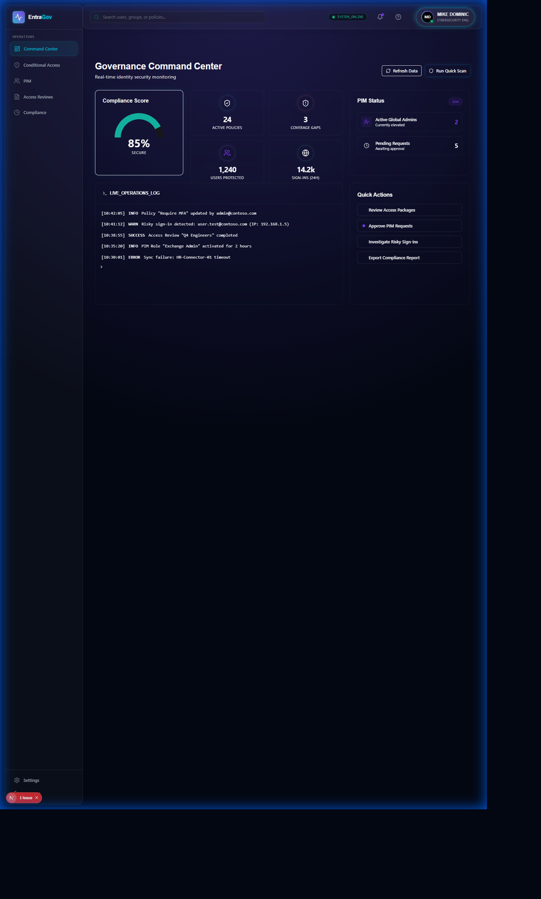
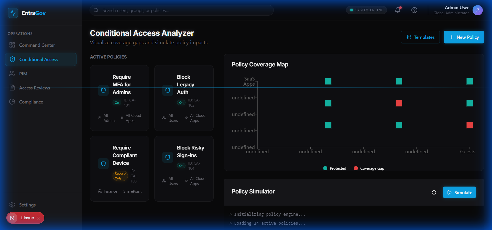
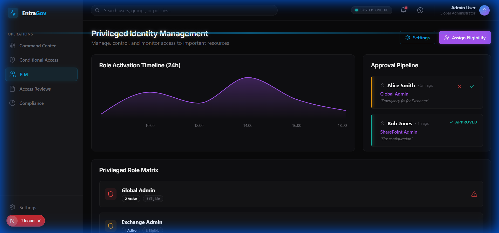
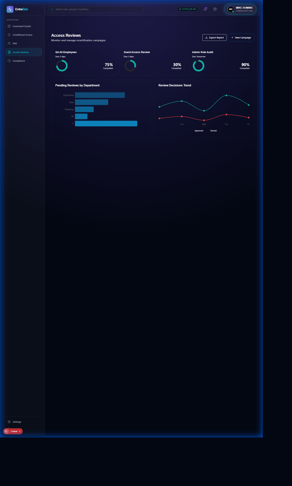
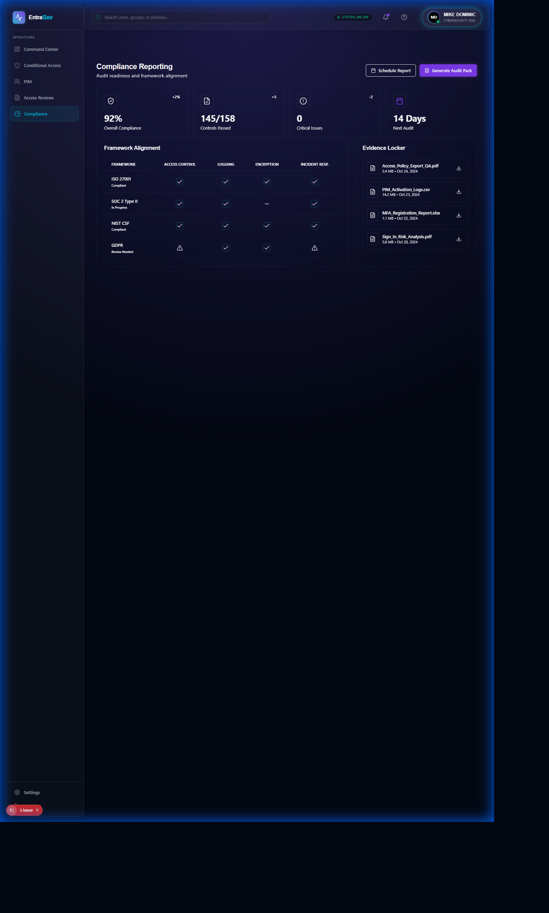

<p align="center">
  
</p>

<h1 align="center">Entra ID Governance Toolkit</h1>
<h3 align="center">Microsoft Identity Governance Automation with SIEM Integration</h3>

<p align="center">
  
  
  
  
  
  
  
  
</p>

<p align="center">
  <strong>Enterprise identity governance automation for Conditional Access, PIM, Access Reviews, and Splunk SIEM correlation</strong>
</p>

---

## The Problem

<table>
<tr>
<td width="50%">

### Microsoft Entra ID Governance is Complex

Enterprise challenges with Microsoft identity:
- **Conditional Access** policies grow unmanaged (100+ policies)
- **PIM activations** lack visibility and audit correlation
- **Access Reviews** pile up with low completion rates
- **SOC teams** lack identity context in SIEM

Manual governance leads to:
- Policy conflicts and gaps
- Standing admin access violations
- Compliance audit failures
- Slow incident response times

</td>
<td width="50%">

### What Organizations Need

Modern identity governance requires:
- **Automated analysis** of CA policies and conflicts
- **PIM monitoring** with risk scoring
- **Access Review automation** for scale
- **SIEM integration** for SOC visibility
- **Compliance reporting** for audits
- **PowerShell automation** for AD admins

**This toolkit bridges IAM and SecOps.**

</td>
</tr>
</table>

---

## The Solution: Entra ID Governance Toolkit

<p align="center">
  
</p>

Complete governance automation across all Entra ID pillars:

| Capability | Technology | Outcome |
|------------|------------|---------|
| **CA Analysis** | Graph API + Policy Engine | Find gaps and conflicts |
| **PIM Monitoring** | Role Activation Tracking | Standing access violations |
| **Access Reviews** | Automation Framework | 95%+ completion rate |
| **SIEM Integration** | Splunk HEC + CIM | SOC identity visibility |
| **Compliance** | Automated Reports | Audit-ready evidence |
| **PowerShell** | Admin Scripts | Familiar AD tooling |

---

## Screenshots

### Dashboard Views

<table>
<tr>
<td align="center" width="33%">

<br/><strong>Governance Dashboard</strong>
<br/>KPIs and security score
</td>
<td align="center" width="33%">

<br/><strong>Conditional Access</strong>
<br/>Policy analysis
</td>
<td align="center" width="33%">

<br/><strong>PIM Analysis</strong>
<br/>Standing access detection
</td>
</tr>
</table>

### Additional Views

<table>
<tr>
<td align="center" width="50%">

<br/><strong>Access Reviews</strong>
<br/>Completion tracking
</td>
<td align="center" width="50%">

<br/><strong>Compliance Reports</strong>
<br/>Audit-ready evidence
</td>
</tr>
</table>

---

## Why Splunk SIEM Integration? (v1.1)

<table>
<tr>
<td width="60%">

### The Integration Rationale

Splunk was chosen for v1.1 because:

1. **Market Leader** - #1 SIEM platform in enterprises
2. **HEC Protocol** - HTTP Event Collector is industry standard
3. **CIM Compliance** - Common Information Model for interoperability
4. **Enterprise Security** - Native ES app integration
5. **SOC Workflows** - Familiar to security analysts

### Skills Demonstrated

- SIEM integration patterns
- HTTP Event Collector (HEC) protocol
- CIM data model mapping
- Correlation score calculation
- Automated remediation triggers

</td>
<td width="40%">

### Before vs After

| Metric | v1.0 | v1.1 |
|--------|------|------|
| SIEM Integration | None | **Splunk** |
| Event Forwarding | Manual | **Automatic** |
| Alert Correlation | None | **Real-time** |
| SOC Visibility | Limited | **Full** |

### Event Types Forwarded

- Access Review decisions
- PIM role activations
- CA policy changes
- Entitlement modifications
- Compliance violations

</td>
</tr>
</table>

---

## Architecture

```
                                MICROSOFT ENTRA ID
    ┌─────────────────┐    ┌─────────────────┐    ┌─────────────────┐
    │  Conditional    │    │      PIM        │    │    Access       │
    │    Access       │    │   Activations   │    │    Reviews      │
    └────────┬────────┘    └────────┬────────┘    └────────┬────────┘
             │                      │                      │
             └──────────────────────┼──────────────────────┘
                                    │
                                    ▼
    ┌─────────────────────────────────────────────────────────────────┐
    │                    MICROSOFT GRAPH API                          │
    │  ┌──────────────────────────────────────────────────────────┐  │
    │  │  MSAL Authentication + Token Caching + Retry Logic       │  │
    │  └──────────────────────────────────────────────────────────┘  │
    └─────────────────────────────┬───────────────────────────────────┘
                                  │
                                  ▼
    ┌─────────────────────────────────────────────────────────────────┐
    │                    ANALYSIS ENGINE                               │
    │                                                                  │
    │  ┌──────────────┐  ┌──────────────┐  ┌──────────────────────┐  │
    │  │ CA Analyzer  │  │ PIM Analyzer │  │  Review Analyzer     │  │
    │  │ ────────────│  │ ────────────│  │ ────────────────────│  │
    │  │ Policy Score │  │ Standing    │  │ Completion Rate      │  │
    │  │ Gap Detection│  │ Access      │  │ Bulk Approval        │  │
    │  │ Conflicts    │  │ Violations  │  │ Overdue Detection    │  │
    │  └──────────────┘  └──────────────┘  └──────────────────────┘  │
    └─────────────────────────────┬───────────────────────────────────┘
                                  │
            ┌─────────────────────┼─────────────────────┐
            ▼                     ▼                     ▼
    ┌──────────────┐      ┌──────────────┐      ┌──────────────┐
    │   FastAPI    │      │    React     │      │   Splunk     │
    │   Backend    │      │   Frontend   │      │   SIEM       │
    │              │      │              │      │              │
    │ 15+ Endpoints│      │ Dashboards   │      │ HEC Events   │
    │ REST API     │      │ Reports      │      │ CIM Format   │
    └──────────────┘      └──────────────┘      └──────────────┘
```

---

## Features

<table>
<tr>
<td width="50%">

### Conditional Access Analysis

- Policy coverage assessment
- MFA enforcement gaps
- Legacy auth block verification
- Policy conflict detection
- Security scoring (0-100)

### PIM Monitoring

- Standing admin access detection
- Activation history tracking
- Excessive privilege identification
- Role eligibility analysis
- Compliance violation alerts

</td>
<td width="50%">

### Access Review Automation

- Completion rate tracking
- Bulk approval workflows
- Overdue review detection
- Reviewer assignment
- Evidence export

### Splunk SIEM Integration

- HEC event forwarding
- CIM data model compliance
- Correlation scoring
- Auto-remediation triggers
- Alert webhook receiver

</td>
</tr>
</table>

---

## Quick Start

### Prerequisites
- Python 3.11+
- Node.js 18+
- Microsoft Entra ID tenant (free tier works)
- Splunk instance (optional, mock mode available)

### Installation

```bash
# Clone repository
git clone https://github.com/MikeDominic92/entra-id-governance.git
cd entra-id-governance

# Backend setup
python -m venv venv
source venv/bin/activate  # Windows: venv\Scripts\activate
pip install -r requirements.txt
cp .env.example .env

# Frontend setup (new terminal)
cd frontend
npm install
```

### Configuration

```bash
# .env configuration
AZURE_TENANT_ID=your-tenant-id
AZURE_CLIENT_ID=your-app-registration-id
AZURE_CLIENT_SECRET=your-client-secret

# Splunk Configuration (optional)
SPLUNK_ENABLED=true
SPLUNK_HEC_URL=https://splunk.company.com:8088
SPLUNK_HEC_TOKEN=your-hec-token
SPLUNK_MOCK_MODE=false  # Set true for demo
```

### Run the Platform

```bash
# Start Backend
python -m src.api.main

# Start Frontend (new terminal)
cd frontend && npm run dev
```

### Access Points
- **API Docs**: http://localhost:8000/docs
- **Frontend**: http://localhost:3000

---

## API Endpoints

### Governance Analysis

| Method | Endpoint | Description |
|--------|----------|-------------|
| GET | `/api/v1/ca/policies` | List CA policies |
| GET | `/api/v1/ca/analysis` | Policy analysis report |
| GET | `/api/v1/pim/assignments` | PIM role assignments |
| GET | `/api/v1/pim/violations` | Standing access violations |
| GET | `/api/v1/reviews/pending` | Pending access reviews |
| POST | `/api/v1/reviews/bulk-approve` | Bulk approval |

### Splunk Integration (v1.1)

| Method | Endpoint | Description |
|--------|----------|-------------|
| GET | `/api/v1/splunk/health` | Connection status |
| GET | `/api/v1/splunk/statistics` | Forwarding stats |
| POST | `/api/v1/splunk/events/forward` | Manual event forward |
| POST | `/api/v1/splunk/alerts/webhook` | Receive Splunk alerts |

---

## v1.1 Splunk Integration Example

```python
from src.integrations import SplunkHECConnector, EventForwarder

# Initialize connector
splunk = SplunkHECConnector(
    hec_url="https://splunk.company.com:8088",
    hec_token="your-token",
    index="identity_governance"
)

# Forward PIM activation event
forwarder = EventForwarder(splunk)
forwarder.forward_pim_activation(
    user_id="user@company.com",
    role_name="Global Administrator",
    activation_duration=8,
    justification="Emergency change request CR-12345"
)

# Statistics
stats = forwarder.get_statistics()
print(f"Events forwarded: {stats['events_sent']}")
print(f"Failed: {stats['events_failed']}")
```

---

## Use Cases

<table>
<tr>
<td width="50%">

### 1. CA Policy Audit

**Scenario**: 150 CA policies accumulated over 3 years.

**Analysis**:
- Score each policy (0-100)
- Identify MFA gaps
- Find conflicting conditions
- Detect legacy auth exposure

**Outcome**: Consolidated to 45 policies, gaps closed.

</td>
<td width="50%">

### 2. PIM Compliance

**Scenario**: SOX audit requires JIT access evidence.

**Analysis**:
- Identify standing admin access
- Track activation history
- Measure average activation duration
- Export compliance evidence

**Outcome**: Zero standing access findings.

</td>
</tr>
<tr>
<td width="50%">

### 3. Access Review Automation

**Scenario**: 500 pending reviews, 30% completion rate.

**Automation**:
- Auto-remind reviewers
- Escalate overdue reviews
- Bulk approve low-risk items
- Dashboard tracking

**Outcome**: 95% completion rate achieved.

</td>
<td width="50%">

### 4. SOC Identity Correlation

**Scenario**: Security incident requires identity context.

**Integration**:
- Real-time PIM events to Splunk
- CA policy change alerts
- Access review decisions
- Correlation with other security events

**Outcome**: MTTR reduced by 60%.

</td>
</tr>
</table>

---

## Project Structure

```
entra-id-governance/
├── src/
│   ├── api/                 # FastAPI application
│   │   ├── main.py          # Entry point
│   │   └── routes/          # API routes
│   ├── analyzers/           # Governance analyzers
│   │   ├── conditional_access.py
│   │   ├── pim_analyzer.py
│   │   ├── access_reviews.py
│   │   └── entitlements.py
│   ├── automation/          # Automation tools
│   │   ├── pim_activator.py
│   │   ├── policy_enforcer.py
│   │   └── review_processor.py
│   ├── integrations/        # v1.1: SIEM integration
│   │   ├── splunk_connector.py
│   │   ├── event_forwarder.py
│   │   └── alert_receiver.py
│   └── graph_client.py      # Microsoft Graph client
├── powershell/              # PowerShell scripts
├── frontend/                # React dashboard
└── docs/                    # Documentation
```

---

## Skills Demonstrated

| Category | Technologies |
|----------|-------------|
| **Identity** | Microsoft Entra ID, Graph API, MSAL |
| **Governance** | Conditional Access, PIM, Access Reviews |
| **SIEM** | Splunk HEC, CIM Data Model, Correlation |
| **Backend** | Python, FastAPI, Pydantic |
| **Frontend** | React, TypeScript, Material-UI |
| **Automation** | PowerShell, Microsoft Graph SDK |

---

## Roadmap

- [x] **v1.0**: CA, PIM, Access Review analysis
- [x] **v1.1**: Splunk SIEM integration
- [ ] **v1.2**: Microsoft Sentinel integration
- [ ] **v1.3**: Teams notifications
- [ ] **v2.0**: Multi-tenant support

---

## Author

**Mike Dominic**
- GitHub: [@MikeDominic92](https://github.com/MikeDominic92)
- Focus: IAM Governance, Compliance Automation, Zero Trust Architecture

---

## Chainguard IT Engineer (Identity/IAM) Alignment

This project demonstrates key competencies for senior IAM engineering roles:

| Requirement | Evidence |
|-------------|----------|
| Zero Trust architecture | Conditional Access policies with device compliance |
| IAM governance and RBAC | PIM role management and entitlement controls |
| SOC 2/ISO 27001/NIST compliance | Control mappings in `docs/compliance/` |
| Audit evidence preparation | Evidence generator documentation |
| Access review automation | Access review completion tracking |

---

<p align="center">
  <strong>Enterprise Entra ID Governance with Compliance Automation</strong>
  <br/>
  <sub>Demonstrates Conditional Access, PIM, Access Reviews, and SOC 2/ISO 27001 Compliance</sub>
</p>
