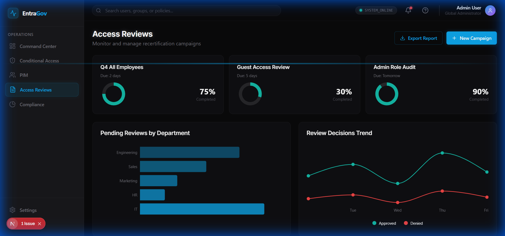
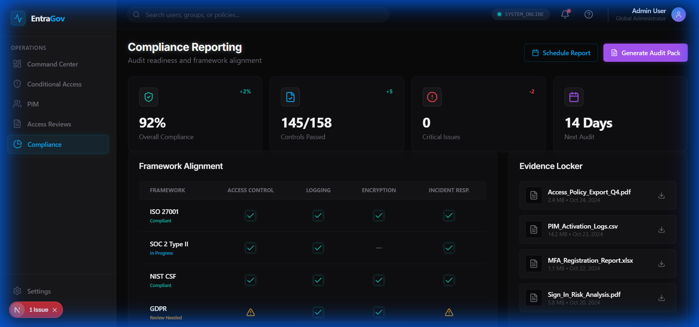

# Entra ID Governance Toolkit - Frontend Walkthrough

Stealth Command Center frontend for Microsoft Entra ID governance, featuring a dark cyber aesthetic with neon accents and glassmorphism effects.

## Technology Stack

- **Framework**: Next.js 16 with App Router
- **Styling**: Tailwind CSS v4 with custom theme
- **Charts**: Recharts for data visualization
- **Icons**: Lucide React
- **Fonts**: Inter (UI) + JetBrains Mono (code/data)

## Design System

### Color Palette
| Color | Hex | Usage |
|-------|-----|-------|
| Void Black | #09090B | Primary background |
| Obsidian | #18181B | Elevated surfaces |
| Azure Blue | #0EA5E9 | Primary accent, active states |
| Cyber Purple | #A855F7 | Governance, PIM actions |
| Electric Teal | #14B8A6 | Success states |
| Neon Red | #EF4444 | Critical alerts |
| Amber Glow | #F59E0B | Warnings |
| Ghost White | #FAFAFA | Primary text |
| Steel Gray | #71717A | Secondary text |

### Visual Effects
- Neon glow borders on interactive elements
- Glassmorphism panels with low opacity
- Subtle grid pattern background
- Pulse animations for real-time indicators
- Hover effects with glow intensification

## Screens

### 1. Governance Command Center (Dashboard)
- Compliance score gauge with animated ring
- Conditional Access coverage cards
- PIM status with active vs eligible admins
- Access reviews progress tracking
- Real-time activity feed (terminal-style)

### 2. Conditional Access Analyzer
- Policy cards with glowing borders
- Coverage gaps heatmap
- Policy simulator with command-line input
- Conflict detection warnings
- AI-powered recommendations

### 3. Privileged Identity Management (PIM)
- Role assignment matrix
- Standing admin detection warnings
- Activation timeline with glowing nodes
- Approval workflow pipeline
- Role utilization radar chart

### 4. Access Reviews Dashboard
- Campaign progress cards
- Reviewer workload distribution
- Overdue alerts with animations
- Bulk action toolbar
- Historical trends chart

### 5. Compliance Reporting
- Executive summary metrics
- Framework alignment matrix (ISO 27001, SOC 2)
- Evidence collection with downloads
- Scheduled reports calendar
- Custom query builder

## Screenshots

### Governance Dashboard


### Conditional Access


### PIM


### Access Reviews


### Compliance


## Running the Frontend

```bash
cd frontend
npm install
npm run dev
```

Visit http://localhost:3000

## Build

```bash
npm run build
```

## Key Technical Decisions

- **Tailwind v4**: CSS-first configuration for cleaner setup
- **Component Architecture**: Reusable Card, Button, Badge with variant support
- **Theme System**: Custom dark theme with CSS variables
- **class-variance-authority**: For component variant management

## Next Steps

- Integrate with Microsoft Graph API
- Add real Conditional Access policy analysis
- Implement PIM role activation workflows
- Connect to Azure AD for live data
